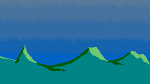

# Un fondo en arte píxel

Ahora nos pondremos a realizar un escenario o fondo en arte píxel. Se puede decir que ya no tenemos la limitación de una resolución muy baja. Pero aún así debemos conseguir un buen efecto que haga juego con el estilo artístico.

## El cielo

Abramos nuestro programa y creemos un archivo de `300x168` px. Lo primero es que pintaremos con  todo el lienzo de color azul. Simplemente elegimos un buen azul y clicamos en el lienzo, toda vez que renombramos la capa como `Cielo`. Listo.

## Las montañas

Creamos una capa con  y le llamamos `Montañas`. Dibujamos un paisaje simple y lo pintamos de verde. Agregamos efectos de luz con un verde más claro y efectos de sombra con uno más oscuro. Guardamos.

## El gradiente del cielo

Lo ideal es no utilizar un cielo plano, totalmente azul. Vamos a agregarle un gradiente. En LibreSprite no es tan sencillo como con otros programas. Debemos dibujar unos rectángulos rellenos con colores que vayan volviéndose más claros conforme vamos subiendo. Al menos unos tres. Luego, con las herramientas *Difuminar* y *Mezclar* le vamos dando un toque de gradiente. Podemos repetir el uso de estas herramientas tanto como deseemos.

