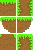

# Hoja de sprites

Una hoja de sprites (o "spritesheet") es una imagen que contiene sprites más pequeños en un arreglo tipo rejilla. Usar una hoja de sprites mejora el rendimiento del juego y reduce el tiempo de carga e inicio del mismo.

## Creando una hoja de sprites

Con nuestro sprite de pasto ya creado, podremos pensar en utilizarlo para pintar escenarios completos conn él, pero también podríamos darnos cuenta que sería muy repetitivo, ya que se deberíamos poder hacer algunas variaciones pequeñas. Incluso necesitamos esquinas para los rincones del jardín. Para ello haremos una hoja de sprites con las variaciones que podamos necesitar del sprite.

### Cambiando el tamaño del lienzo

Presionamos  y aparece el recuadro de cambio de tamaño del lienzo. Lo cambiaremos de manera que puedan caber seis sprites más un margen de un píxel entre cada uno, pero no en las orillas, solo entre los mosaicos. Como nuestro sprite es de `16x16` y queremos poner dos a lo ancho, cambiamos el ancho del lienzo a 16 px de ancho por los 2 sprites + 1 px de margen entre ellos = `33` px. En cuanto a la altura, la dejaremos en 16 por tres sprites + 2 px de margen = `50` px de alto. En resumen, cambiamos el lienzo a un tamaño de `33x50`, pero aún no cliquemos en *Aceptar*.

LibreSprite nos ayuda bastante con su interfaz, ya que al momento de cambiar el tamaño del lienzo nos permite ver los márgenes en la parte inferior. Podemos confirmar que nuestros cálculos de tamaño son correctos si además presionamos alguna de las flechas que se nos muestran a mano derecha. Estas nos sirven para mover el sprite de posición. Elijamos la que apunta arriba a la izquierda y el mosaico se moverá a ese lugar. Corroboremos los bordes que nos dice LibreSprite y si todo va bien, aceptemos ahora sí.

### Creando el mosaico terminal

El siguiente paso es agregar una capa adicional. Damos clic derecho sobre la capa existente y luego en *Crear nuevo* o presionamos . Seleccionamos la nueva capa y dibujamos la variación que tengamos en mente, por ejemplo, la orilla de la plataforma.

Si no queremos estar buscando cuáles colores ya hemos usado, basta con seleccionar el cuentagotas o presionar  para luego clicar el color que deseemos copiar. Luego cambiamos al lápiz y ya podemos trazar con dicho color.

Una vez que hayamos terminado esta primera variación, la moveremos de lugar. Seleccionamos la herramienta *Mover* o presionamos  y la reubicamos en medio y a la derecha. Recordemos que debemos dejar un píxel de margen entre cada sprite. Ahora bien, duplicamos la capa 2 mediante  y luego la volteamos horizontalmente con . En sus propiedades podemos cambiarle el nombre a *Capa 3* Ya tenemos las dos orillas.

### Los mosaicos verticales

Ahora queremos crear los mosaicos laterales que irían a media altura. Estos deben tener el pasto a los lados, no encima y además en una porción más delgada del mosaico. Tomemos la capa 1 y dupliquémosla. Luego la movemos a la derecha de la misma capa 1 y la renombramos como *Capa 4*.

Con la capa 4 seleccionada presionamos  para elegir el sprite completo y luego nos dirigimos a *Editar -> Rotar -> 90 horario* y listo, salimos con . Ya tenemos el primer paso: pasto vertical. Sin embargo, queremos que se encuentre en ambos lados. Así que tomamos la herramienta *Marco* , seleccionamos una porción un poco menor a la mitad derecha, incluyendo los píxeles verdes con excepción de la línea exterior y presionamos  para copiar la selección. Luego pegamos con , la movemos un poco a la derecha para llegar a la orilla. De nuevo seleccionamos la nueva mitad y volvemos a copiar y pegar, enseguida aplicamos un reflejo horizontal con  y movemos al otro extremo del sprite. Y para dar mayor sensación de variedad, terminamos presionando  para reflejar verticalmente y acomodamos el resultado por si se mueve de posición y ya tenemos nuestro mosaico vertical.

### Los mosaicos conectores

El siguiente paso es crear los mosaicos que nos permitirán conectar el mosaico superior con los verticales. Para ello, podemos optar por crear sprites que tengan píxeles verdes solo en las esquinas superiores, dejando los cafés en lo restante.

Dupliquemos la capa 1 y la movemos al extremo inferior del lienzo. Le llamaremos *Capa 5*. Enseguida duplicamos la *Capa 4*, la cual llevaremos al lado de la *5*. Con la copia de la *Capa 4* seleccionada, la movemos de lugar en el *Editor de capas* de manera que quede justo encima de la *Capa 5*. Clic derecho y luego *Combinar hacia abajo* o . Con esto tenemos ambos sprites en la misma capa.

Todo lo que hagamos ahora es solo en la *Capa 5*. Procedemos a seleccionar solo la parte superior del sprite vertical, copiarlo y pegarlo en el sprite superior y hacer retoques y borrar el sprite vertical para que solo haya una baldosa en la *Capa 5*.

Por último, el mosaico que representará solo una columna con pasto es la otra combinación de la *Capa 1* con la *Capa 4*, solo que la capa superior sí debe tener pasto. Duplicamos ambas capas y las combinamos. Ocultamos las demás capas para luego seleccionar la porción superior del sprite superior, copiarla y pegarla en el vertical. Eliminamos los restos, hacemos retoques y posicionamos lo resultante abajo a la derecha. Volvemos visibles las demás capas y habremos terminado.

### Exportando la hoja de sprites

Por defecto, LibreSprite guarda sus archivos con el formato `.ase` que es el que utiliza Aseprite. Es buena idea mantener nuestros archivos editables en su programa nativo, sin embargo, para poder utilizar nuestros sprites en algún motor de videojuegos, debemos exportarlos como imagen. El formato recomendado en el `.png`, ya que soporta transparencias. Nos vamos a *Archivo -> Exportar*, escogemos la carpeta donde se guardará, cambiamos el tipo a `png files` y aceptamos. LibreSprite nos avisará que el formato no soporta las capas, lo cual no nos afecta en realidad, así que solo aceptamos y guardamos. Ya contamos con nuestra hoja de sprites, lista para importarse en algún motor de juegos.

{width=25%}

